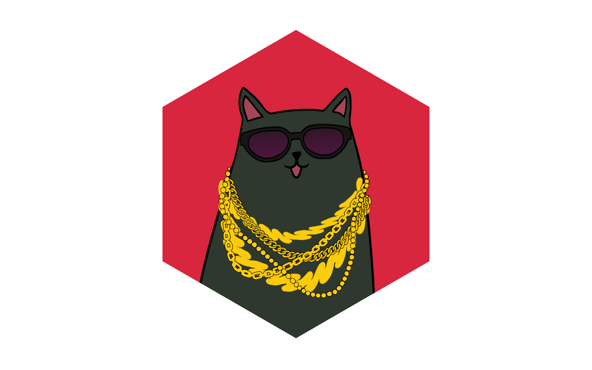

# Cats STM

Cats STM is a library for writing composable in-memory transactions which will handling correct locking, optimistic concurrency and automatic retries for you. It is intended as a safe, composable alternative to locks and semaphores that also allows a higher level of concurrency.

### Transactional and Safe

Write `Txn` expressions in terms of mutable `TVar`s (analogous to Ref from Cats Effect). Run `Txn[A]` expressions transactionally to obtain an `IO[A]` (or `F[A]` for the `Async[F]` of your choice). The `STM` runtime will determine what locks need to be acquired and in what order to avoid deadlock.

### Composable

Trivially compose transactional expressions into larger ones without explicit locking or requiring any knowledge of the internals of the subexpressions and what locks they require.

### Automatic retries

Specify pre-conditions and the committing of a transaction will be automatically retried until the pre-conditions are satisifed.

### Fine-grained, optimistic concurrency

There are no global locks and per-`TVar` locks are acquired only when a transaction has succeeded and should be committed.
